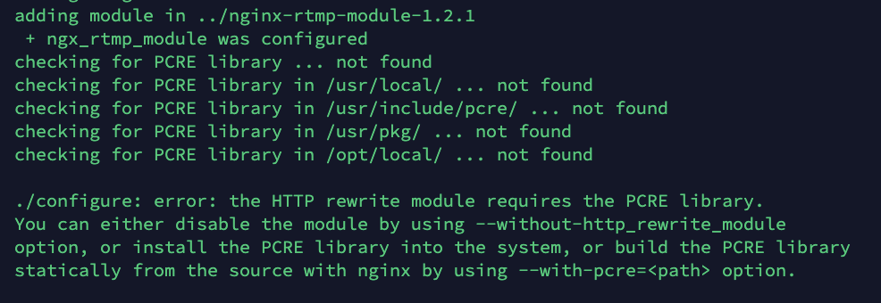

#### 环境准备


[下载Nginx](http://nginx.org/en/download.html)

`wget http://nginx.org/download/nginx-1.16.0.tar.gz  `

解压nginx-1.16.0.tar.gz

`tar -zvxf nginx-1.16.0.tar.gz`

[下载RTMP](https://github.com/arut/nginx-rtmp-module)

`wget https://github.com/arut/nginx-rtmp-module/archive/v1.2.1.tar.gz`

解压v1.2.1.tar.gz

`tar -zvxf v1.2.1.tar.gz`


#### 进入Nginx解压目录

执行configure (--add-model后面跟随的是rtmp文件夹的位置,如有不对注意修改)：

`./configure --prefix=./bin --add-module=../nginx-rtmp-module-1.2.1`

```
nginx 中 gzip 模块需要 zlib 库，rewrite模块需要 pcre 库，ssl 功能需要 openssl 库。所以如果服务器未安装这三个依赖库的话会报错，需要先安装这三个依赖库
```

执行过程中,查看是否有not found,导致生成makefile文件失败



如有类似错误需要安装对应模块:

安装命令:

` yum -y install openssl openssl--devel pcre pcre-devel`

 再次运行 (--add-model后面跟随的是rtmp文件夹的位置,如有不对注意修改):

 `./configure --prefix=./bin --add-module=../nginx-rtmp-module-1.2.1`

看是否还存在报错,当成功运行会编译出Makefile文件

编译Makefile文件:

`make install`

编译完生成bin目录:

```
$ ls
auto  bin  CHANGES  CHANGES.ru  conf  configure  contrib  html  LICENSE  Makefile  man  objs  README  src
$ cd bin/
$ ls
conf  html  logs  sbin
#conf：配置相关
#html：欢迎页面、错误页面
#logs：日志存放区
#sbin：可执行文件存放区
```

#### 修改配置

Nginx默认不支持rtmp，需要修改配置文件。

进入bin/conf目录，找到 nginx.conf 文件,编辑nginx配置文件。

`vim nginx.conf`
```
#设置root用户
user root;
worker_processes  1;
error_log  logs/error.log debug;
events {
    worker_connections  1024;
}
#rtmp标签
rtmp {
    #服务标签，一个rtmp服务中可以有多个server标签，每个标签可监听不同端口号
    server {
        #注意端口占用，1935为默认端口
        listen 1935;
        #应用标签，一个服务标签中可以有多个应用标签
        application myapp {
            live on;
            #丢弃闲置5s的连接
            drop_idle_publisher 5s;
        }
    }
}
http {
    server {
        #rtmp模块位置
        set $rtmp /root/xx/nginx-rtmp-module-1.2.1;
        #注意端口占用
        listen      8080;
        #数据统计模块，将流媒体的状态记录到 stat.xsl 中
        location /stat {
            rtmp_stat all;
            rtmp_stat_stylesheet stat.xsl;
        }
        #将stat.xsl 访问目录指定到nginx-rtmp-module中
        location /stat.xsl {
        #注意目录
            root $rtmp_lib;
        }
        #控制器模块，可录制直播视频、踢出推流/拉流用户、重定向推流/拉流用户
        location /control {
            rtmp_control all;
        }
        location /rtmp-publisher {
            #注意目录
            root $rtmp_lib/test;
        }
        location / {
            #注意目录
            root $rtmp_lib/test/www;
        }
    }
}
```

编辑完成后.回到nginx根目录,运行nginx

`./bin/sbin/nginx`

可能会报错:
```
nginx: [alert] could not open error log file: open() "./bin/logs/error.log" failed (2: No such file or directory)
```

就在bin/logs目录下创建error.log文件,即可.
查看nginx服务是否启动
```
ps aux | grep nginx
root      7245  0.0  0.2  53368  5320 ?        Ss   15:47   0:00 nginx: master process ./bin/sbin/nginx
root    7246  0.0  0.3  53768  6076 ?        S    15:47   0:00 nginx: worker process
root      7263  0.0  0.0 112708   984 pts/4    R+   15:50   0:00 grep --color=auto nginx
```

启动成功后,在浏览器中:
```
#nginx
xxx.xxx.xxx.xxx:8080
#rtmp管理页面
xxx.xxx.xxx.xxx:8080/stat
```
